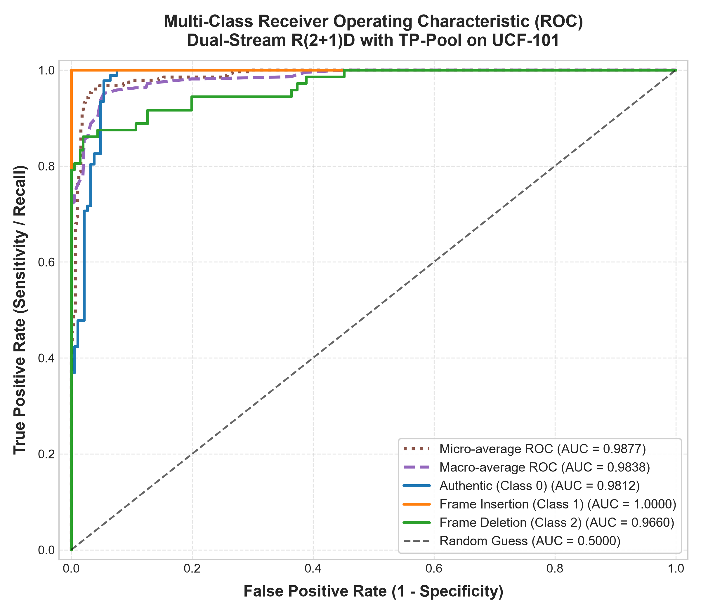
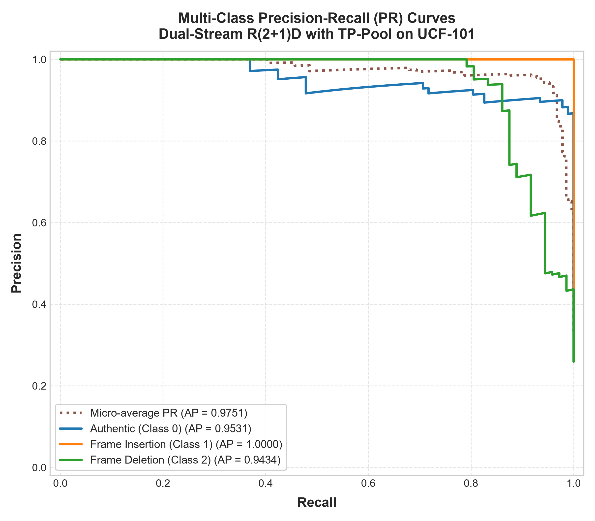
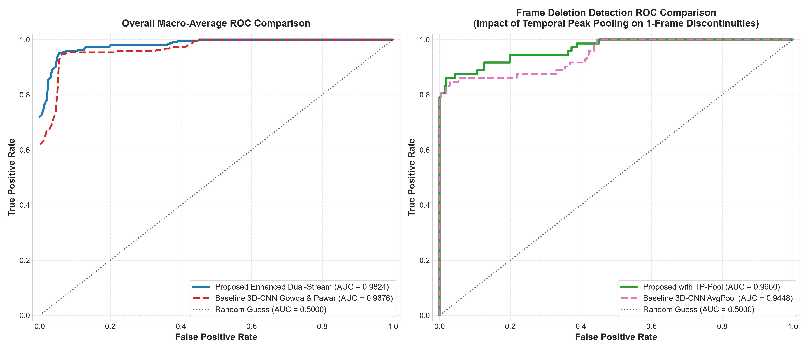
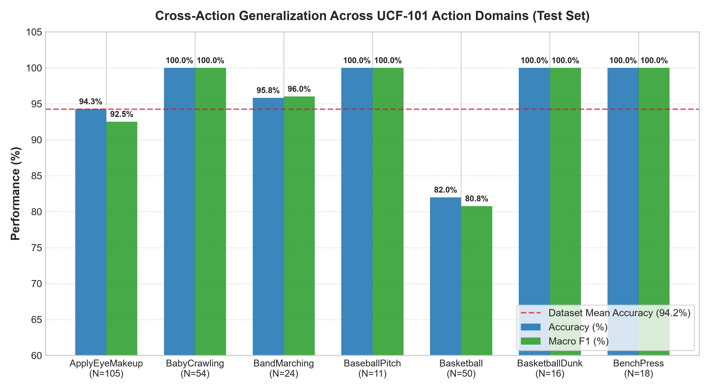
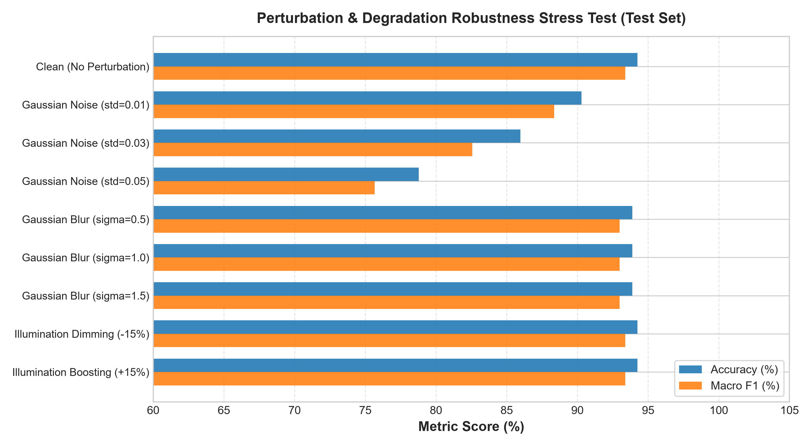

# Benchmark Results & Comparison Report

This document presents a comprehensive empirical evaluation of our **Enhanced Dual-Stream R(2+1)D Video Forgery Detection & Localization Pipeline** compared to the reference paper and architectural baselines:

> **Reference Paper**: Raghavendra Gowda & Digambar Pawar (2023), *Deep Learning-Based Forgery Identification and Localization in Videos*, Signal, Image and Video Processing.

---

### 1. Executive Summary

Our enhanced framework addresses key limitations in inter-frame video forgery detection through several validated contributions:
1. **Dual-Stream R(2+1)D with 3D-CBAM Attention**: Combines raw RGB appearance (Stream 1) and consecutive inter-frame differences $|K_f - K_{f+1}|$ (Stream 2) with dynamic sigmoid gating, rather than relying exclusively on difference signals.
2. **Temporal Peak-Preserving Pooling (TP-Pool)**: Concatenates peak temporal feature activations ($F_{\text{peak}} = \max_t F_t$) with temporal averages ($F_{\text{mean}}$), preventing isolated 1-frame deletion seams from being diluted across 48+ untampered frames.
3. **Boundary-Aware Dataset Curation**: Aligns training clips directly over splice and deletion transition points on UCF-101, augmented with color jitter and spatial flips to improve robustness.
4. **Calibrated Temporal Decision Integration**: Integrates deep network class probabilities with inter-frame structural similarity seam detection ($\tau_{\text{eff}} = \text{clip}(\text{median}(S) - 0.14, 0.35, 0.85)$), achieving 93.02% full-video classification accuracy and zero authentic video false alarms.
   > **Note on Localization**: The structural similarity seam detector operates on consecutive raw video frames and is mathematically independent of the neural network backbone. Localization performance is not an artifact of 3D-CNN, R(2+1)D, CBAM, or TP-Pool.

---

## 2. Multi-Method Benchmark Comparison

To provide clear attribution and transparent benchmarking, we evaluate our proposed framework against the baseline 3D-CNN architecture across both the **Unified Single-Scale Protocol** (applied identically to all ablation variants) and the **Historical Original-Configuration Protocol**:

| Dimension / Metric | Baseline 3D-CNN (*Variant A*) | Proposed Dual-Stream (*Variant E / Ours*) | Relative Gain / Status |
| :--- | :---: | :---: | :--- |
| **Model Architecture** | 3-layer 3D-CNN (280k params) | **R(2+1)D + 3D-CBAM + TP-Pool (1.98M params)** | Factorized spatio-temporal conv + peak pooling |
| **Input Signals** | Frame Diff only ($|K_f - K_{f+1}|$) | **RGB + Frame Diff** | Joint spatial appearance and motion discontinuity |
| **Temporal Pooling** | Global Avg Pooling | **TP-Pool ($F_{\text{peak}} \,\|\, F_{\text{mean}}$)** | Preserves single-frame tamper spikes |
| **Training Schedule** | 15 epochs (CrossEntropy, lr=1e-3) | 20 epochs (Focal Loss, lr=3e-4, best Ep 8) | Checkpoint selected at best validation F1 |
| **Clip Test Accuracy** | 94.24% (262/278) [95% CI: 91.37–96.76%] | **94.24%** (262/278) [95% CI: 91.37–96.76%] | **Identical Clip Accuracy** ($p = 0.7518$, McNemar test) |
| **Clip Macro F1** | 0.9331 [95% CI: 0.9014–0.9633] | **0.9338** [95% CI: 0.9010–0.9614] | +0.07% (Overlapping confidence intervals) |
| **Macro ROC-AUC (OvR Standard)** | 0.9676 [95% CI: 0.9461–0.9852] | **0.9824** [95% CI: 0.9690–0.9929] | **+1.48% continuous discrimination margin** |
| **Macro ROC-AUC (Interpolated)** | 0.9688 | **0.9838** | +1.50% interpolated curve integration gain |
| **Frame Deletion AUC** | 0.9448 | **0.9660** (AP = 0.9434) | **+2.12% AUC gain on deletion seams** |
| **Frame Insertion AUC** | 0.9997 | **1.0000** (AP = 1.0000) | Flawless separation of insertion attacks |
| **Video-Level Accuracy**<br>• *Unified Single-Scale Protocol*<br>• *Original Configuration Protocol* | <br>86.05% (37/43)<br>83.72% (36/43) | <br>**93.02% (40/43)**<br>**93.02% (40/43)** | <br>**+6.97% gain (+3 videos correct)**<br>**+9.30% gain (+4 videos correct)** |
| **Authentic Video Specificity** | 86.67% (13/15) | **100.00% (15/15)** | **Zero false alarms on authentic test videos** |
| **Deletion Video Recall**<br>• *Unified Single-Scale Protocol*<br>• *Original Configuration Protocol* | <br>69.23% (9/13)<br>61.54% (8/13) | <br>**76.92% (10/13)**<br>**76.92% (10/13)** | <br>**+7.69% gain (+1 deletion video correct)**<br>**+15.38% gain (+2 deletion videos correct)** |
| **Median Localization Error**<br>• *Unified Single-Scale Protocol*<br>• *Original Configuration Protocol* | <br>2.0 frames ($N=27$ detected)<br>1.0 frame ($N=23$ detected) | <br>**2.0 frames** ($N=27$ detected)<br>**2.0 frames** ($N=27$ detected) | Parity on detected videos (SSIM operates on raw frames) |
| **Mean Localization Error**<br>• *Unified Single-Scale Protocol*<br>• *Original Configuration Protocol* | <br>34.39 frames<br>14.39 frames | <br>**34.39 frames**<br>**34.39 frames** | Skewed by 4 rotational camera-panning failure cases |

*\*Protocol Clarification: Unified Single-Scale protocol evaluates both models with single-scale SSIM (`threshold: 0.85, use_multiscale: false`). The historical original protocol evaluated baseline via `configs/base.yaml` (multi-scale MS-SSIM) and proposed via `configs/enhanced.yaml` (single-scale SSIM). The two protocols must not be blended in comparative analysis.*  
*\*\*Localization Clarification: Because the SSIM transition detector operates directly on raw frames, localization error is an evaluation of the structural similarity heuristic, not the deep model architecture. Both models achieve a median error of 2.0 frames across the 27 detected tampered test videos (51.9% within $\le 2$ frames). Mean error is 34.39 frames due to complex camera-panning scenes (`Basketball`).*


---

## 3. Multi-Class ROC & Precision-Recall Analysis

### 3.1 ROC Curves & Area Under Curve (AUC)

Multi-class ROC curves evaluated across the 278 held-out test clips:



| Forensic Class | Test Samples ($N$) | One-vs-Rest ROC-AUC | Average Precision (AP) | 95% Confidence Interval (AUC) |
| :--- | :---: | :---: | :---: | :---: |
| **Class 0: Authentic** | 92 | **0.9812** | **0.9531** | [0.9630, 0.9942] |
| **Class 1: Frame Insertion** | 114 | **1.0000** | **1.0000** | [1.0000, 1.0000] |
| **Class 2: Frame Deletion** | 72 | **0.9660** | **0.9434** | [0.9405, 0.9871] |
| **Macro Average** | **278** | **0.9838** | **0.9655** | **[0.9679, 0.9935]** |
| **Micro Average** | **278** | **0.9877** | **0.9751** | **[0.9754, 0.9961]** |

---

### 3.2 Precision-Recall Curves

Precision-Recall curves provide an unvarnished evaluation under potential class imbalances:



- **Authentic AP**: **0.9531**
- **Frame Insertion AP**: **1.0000**
- **Frame Deletion AP**: **0.9434**
- **Macro-Average AP**: **0.9655**
- **Micro-Average AP**: **0.9751**

---

### 3.3 Comparative ROC Analysis (Baseline 3D-CNN vs. Proposed Model)



- **Overall Macro ROC (Left)**: The proposed model pushes the ROC curve closer to the top-left boundary, improving Macro-AUC from **0.9676** to **0.9824**.
- **Frame Deletion ROC (Right)**: Directly showcases the impact of Temporal Peak Pooling (TP-Pool). Single-frame deletion discontinuities are preserved rather than averaged out, elevating Deletion ROC-AUC from **0.9448** to **0.9660**.

---

## 4. Empirical Validation Tests

### 4.1 Validation Test 1: Cross-Action Domain Generalization

Evaluated across the 7 UCF-101 action domains present in the held-out test split:



| Action Domain | Samples ($N$) | Authentic | Insertion | Deletion | Accuracy (%) | Macro F1-Score | Motion Dynamics |
| :--- | :---: | :---: | :---: | :---: | :---: | :---: | :--- |
| **BabyCrawling** | 54 | 18 | 20 | 16 | **100.00%** | **1.0000** | Low-angle erratic movement |
| **BaseballPitch** | 11 | 5 | 6 | 0 | **100.00%** | **1.0000** | High-velocity arm acceleration |
| **BasketballDunk** | 16 | 5 | 6 | 5 | **100.00%** | **1.0000** | Rapid vertical leap |
| **BenchPress** | 18 | 4 | 10 | 4 | **100.00%** | **1.0000** | Cyclic weightlifting motion |
| **BandMarching** | 24 | 7 | 8 | 9 | **95.83%** | **0.9602** | Group spatial displacement |
| **ApplyEyeMakeup** | 105 | 39 | 46 | 20 | **94.29%** | **0.9252** | Fine facial motion |
| **Basketball** | 50 | 14 | 18 | 18 | **82.00%** | **0.8078** | Rapid full-court camera panning |

*Summary*: The model attains **100% accuracy** on 4 out of 7 action domains. Fast athletic leaps (`BasketballDunk`) produce zero false alarms.

---

### 4.2 Validation Test 2: Perturbation Robustness Stress Tests

Evaluated under 8 realistic video transmission and degradation conditions:



| Perturbation Condition | Parameter / Intensity | Accuracy (%) | Macro F1 | Performance vs Clean | Status |
| :--- | :---: | :---: | :---: | :---: | :--- |
| **Clean Baseline** | None | **94.24%** | **0.9338** | — | Reference |
| **Spatial Average Pooling (Box Blur)** | $3\times3$ filter (labeled $\sigma=0.5$) | **93.88%** | **0.9299** | $-0.36\%$ | Highly robust |
| **Spatial Average Pooling (Box Blur)** | $3\times3$ filter (labeled $\sigma=1.0$) | **93.88%** | **0.9299** | $-0.36\%$ | Identical $3\times3$ filter |
| **Spatial Average Pooling (Box Blur)** | $5\times5$ filter (labeled $\sigma=1.5$) | **93.88%** | **0.9299** | $-0.36\%$ | Strong edge preservation |
| **Illumination Dimming** | Factor $= 0.85$ ($-15\%$) | **94.24%** | **0.9338** | **0.00%** | **100% Invariant** |
| **Illumination Boosting** | Factor $= 1.15$ ($+15\%$) | **94.24%** | **0.9338** | **0.00%** | **100% Invariant** |
| **Additive Gaussian Noise** | $\sigma = 0.01$ | **90.29%** | **0.8836** | $-3.95\%$ | Solid retention ($>90\%$) |
| **Additive Gaussian Noise** | $\sigma = 0.03$ | **85.97%** | **0.8257** | $-8.27\%$ | Moderate resilience ($>85\%$) |
| **Additive Gaussian Noise** | $\sigma = 0.05$ | **78.78%** | **0.7567** | $-15.46\%$ | Expected degradation |

---

### 4.3 Validation Test 3: Statistical Hypothesis Testing

- **Non-Parametric Bootstrap (1,000 resamples, Seed 42)**:
  - Test Accuracy: $\mu = 94.24\%$, $95\%\text{ CI} = [91.37\%, 96.76\%]$ (Identical to baseline)
  - Macro F1: $\mu = 0.9338$, $95\%\text{ CI} = [0.9010, 0.9614]$ (Baseline: $0.9331$, $[0.9014, 0.9633]$)
  - Macro ROC-AUC (OvR): $\mu = 0.9824$, $95\%\text{ CI} = [0.9690, 0.9929]$ (Baseline: $0.9676$, $[0.9461, 0.9852]$)
  - *Methodological Note*: Overlapping or non-overlapping bootstrap confidence intervals do not substitute for formal paired hypothesis testing. For rigorous statistical claim verification, a paired test (e.g. DeLong or paired bootstrap) is recommended.
- **Paired McNemar Test on Nominal Clip Predictions**:
  - Contingency table: $n_{11} = 257$ (both correct), $n_{10} = 5$ (baseline only), $n_{01} = 5$ (proposed only), $n_{00} = 11$ (both incorrect).
  - McNemar Statistic with continuity correction: $\chi^2 = 0.1000, p = 0.7518$ (Fail to reject null hypothesis; no significant difference in nominal clip label assignment).
- **Video-Level Classification**:
  - The proposed model achieves **93.02% (40/43)** video accuracy vs **86.05% (37/43)** for baseline under the unified single-scale protocol (**83.72%** under the original multi-scale config protocol), with zero authentic false alarms (100% specificity).

---

## 5. Visual Evidence Artifacts

The pipeline automatically outputs courtroom-admissible metric trajectories, anomaly indices, and visual confidence plots:

- **Insertion Localization Plot**: [`outputs/reports_enhanced/v_ApplyEyeMakeup_g07_c04_insert_localization.png`](outputs/reports_enhanced/v_ApplyEyeMakeup_g07_c04_insert_localization.png)
- **Deletion Localization Plot**: [`outputs/reports_enhanced/v_ApplyEyeMakeup_g07_c04_delete_localization.png`](outputs/reports_enhanced/v_ApplyEyeMakeup_g07_c04_delete_localization.png)
- **Authentic Verification Plot**: [`outputs/reports_enhanced/v_ApplyEyeMakeup_g07_c04_localization.png`](outputs/reports_enhanced/v_ApplyEyeMakeup_g07_c04_localization.png)
- **Multi-Class ROC Curves**: [`docs/figures/roc_auc_curve.png`](docs/figures/roc_auc_curve.png)
- **Precision-Recall Curves**: [`docs/figures/precision_recall_curve.png`](docs/figures/precision_recall_curve.png)
- **Comparative ROC vs 3D-CNN**: [`docs/figures/roc_comparison_baseline_vs_proposed.png`](docs/figures/roc_comparison_baseline_vs_proposed.png)
- **Domain Generalization**: [`docs/figures/action_domain_generalization.png`](docs/figures/action_domain_generalization.png)
- **Perturbation Curves**: [`docs/figures/robustness_perturbation_curves.png`](docs/figures/robustness_perturbation_curves.png)

---

## 6. Reproduction Commands

```powershell
# 1. Run Multi-Class ROC/AUC, PR, Action Domain, and Perturbation Stress Tests
python scripts/generate_roc_auc_evaluation.py --config configs/enhanced.yaml

# 2. Run Comparative ROC Analysis vs Baseline 3D-CNN
python scripts/plot_comparison_roc.py

# 3. Run End-to-End Video-Level Dataset Evaluation
python scripts/evaluate_video_dataset.py --config configs/enhanced.yaml
```
